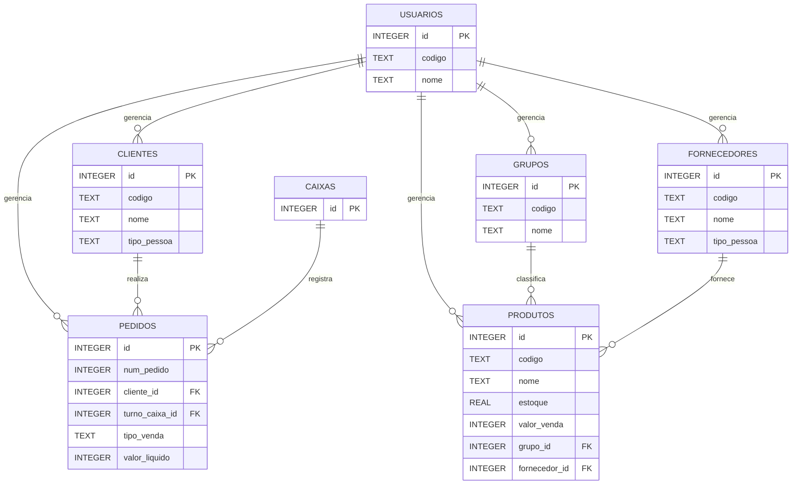

# Modelo Entidade Relacionamento (MER)

```mermaid
erDiagram

    USUARIOS ||--o{ CLIENTES : gerencia
    USUARIOS ||--o{ FORNECEDORES : gerencia
    USUARIOS ||--o{ GRUPOS : gerencia
    USUARIOS ||--o{ PRODUTOS : gerencia
    USUARIOS ||--o{ PEDIDOS : gerencia

    GRUPOS ||--o{ PRODUTOS : classifica

    FORNECEDORES ||--o{ PRODUTOS : fornece

    CLIENTES ||--o{ PEDIDOS : realiza

    CAIXAS ||--o{ PEDIDOS : registra

    USUARIOS {
        INTEGER id PK
        TEXT codigo
        TEXT nome
    }

    CLIENTES {
        INTEGER id PK
        TEXT codigo
        TEXT nome
        TEXT tipo_pessoa
    }

    FORNECEDORES {
        INTEGER id PK
        TEXT codigo
        TEXT nome
        TEXT tipo_pessoa
    }

    GRUPOS {
        INTEGER id PK
        TEXT codigo
        TEXT nome
    }

    PRODUTOS {
        INTEGER id PK
        TEXT codigo
        TEXT nome
        REAL estoque
        INTEGER valor_venda
        INTEGER grupo_id FK
        INTEGER fornecedor_id FK
    }

    PEDIDOS {
        INTEGER id PK
        INTEGER num_pedido
        INTEGER cliente_id FK
        INTEGER turno_caixa_id FK
        TEXT tipo_venda
        INTEGER valor_liquido
    }

    CAIXAS {
        INTEGER id PK
    }
```

## Legenda

* PK = Chave Primária
* FK = Chave Estrangeira
