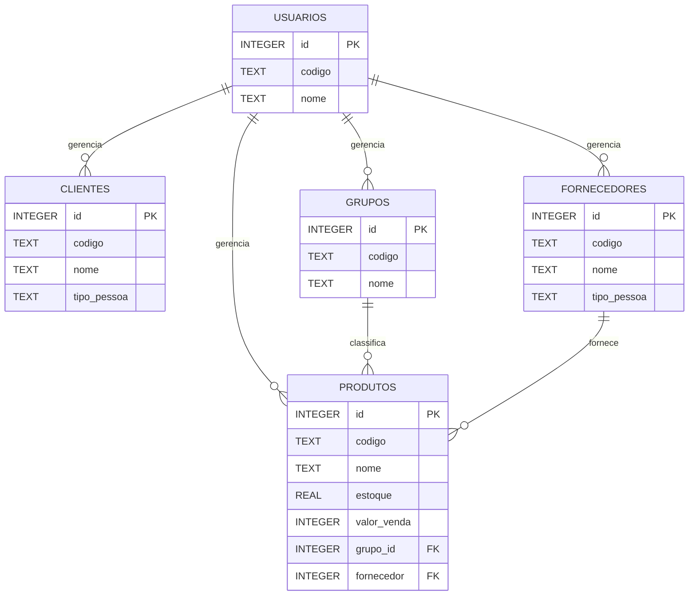

# Modelo Entidade Relacionamento (MER)



## Legenda

- PK = Chave Primária
- FK = Chave Estrangeira

## Observações

Todas as tabelas possuem os campos:

- criado_por
- atualizado_por
- data_criacao
- data_atualizacao

que referenciam a tabela `USUARIOS`.
```
