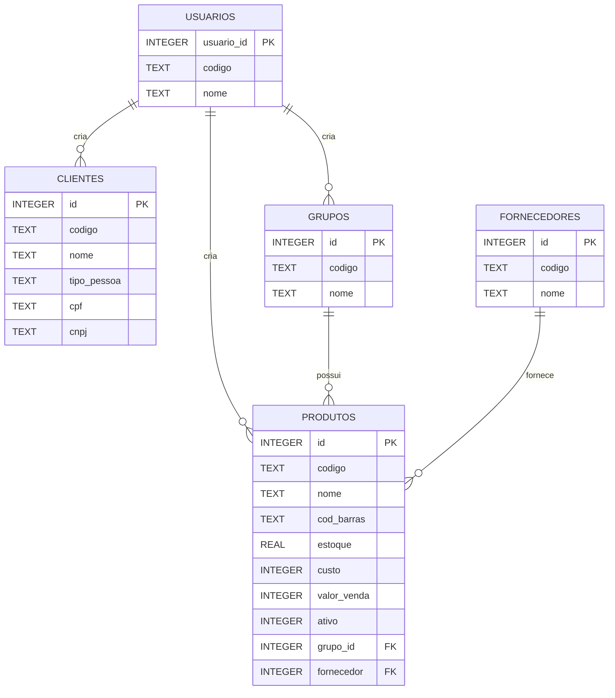

```mermaid
erDiagram

    USUARIOS ||--o{ PRODUTOS : cria
    USUARIOS ||--o{ CLIENTES : cria
    USUARIOS ||--o{ GRUPOS : cria

    GRUPOS ||--o{ PRODUTOS : possui

    FORNECEDORES ||--o{ PRODUTOS : fornece

    PRODUTOS {
        INTEGER id PK
        TEXT codigo
        TEXT nome
        TEXT cod_barras
        REAL estoque
        INTEGER custo
        INTEGER valor_venda
        INTEGER ativo
        INTEGER grupo_id FK
        INTEGER fornecedor FK
    }

    CLIENTES {
        INTEGER id PK
        TEXT codigo
        TEXT nome
        TEXT tipo_pessoa
        TEXT cpf
        TEXT cnpj
    }

    GRUPOS {
        INTEGER id PK
        TEXT codigo
        TEXT nome
    }

    FORNECEDORES {
        INTEGER id PK
        TEXT codigo
        TEXT nome
    }

    USUARIOS {
        INTEGER usuario_id PK
        TEXT codigo
        TEXT nome
    }
```